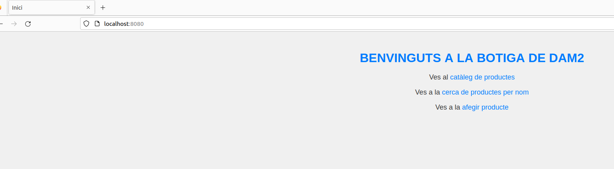
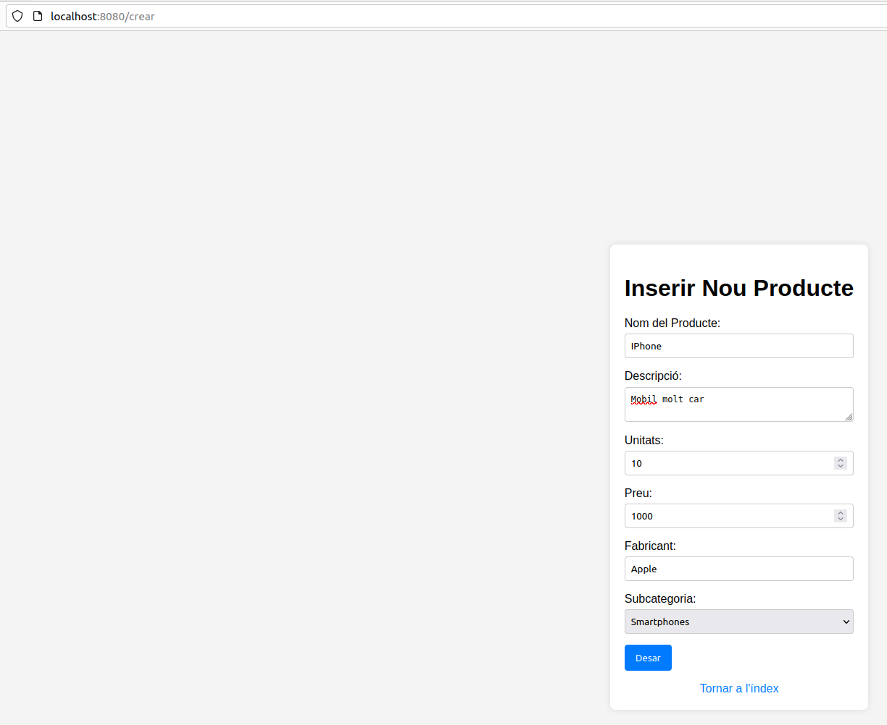
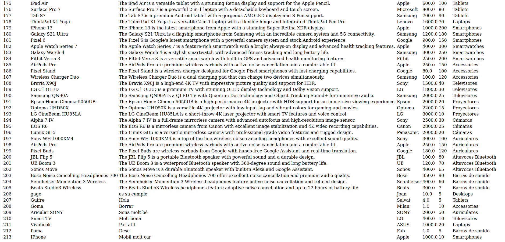

# UF4_M06_PRACTICA_2
## Repartiment de la tasca
### El Joan i jo (Guifré) hem fet la primera part del apartat de 6 punts, jo he fet la segona part de l'activitat de 6 punts i el Joan ha de acabar el crud.

## Explicacio de la part de 6 punts
### Un cop iniciat el web service, al endpoint root apareix la opcio de afegir producte.

### Clicarem la opció i ens sortirà un formulari per afegir un producte. La subcategoria és un desplegable on apareixeran les subcategories que hi hagi guardades a la base de dades.

### Clicarem a desar de manera que es guararà a la base de dades i es mostrarà la vista del catàleg amb tots els productes que hi hagi a la base de dades. Al final es veu la que acabem d'afegir.

